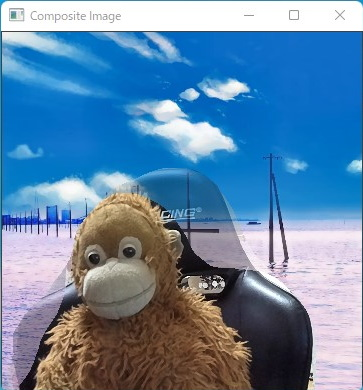

# virtual-background-by-depthai

This is a script to create a virtual background for a web conference using DepthAI.
It uses [StereoDepth](https://docs.luxonis.com/projects/api/en/latest/components/nodes/stereo_depth/)'s disparity to create the mask.




## Pre-requisites
1.  [OpenCV AI Kit - Lite (OAK-D-Lite)](https://docs.luxonis.com/projects/hardware/en/latest/pages/DM9095.html)
2.  Install requirements
    ```shell
    python3 -m pip install -r requirements.txt
    ```

## Usage
```shell
usage: main.py [-h] [-b BACKGROUND]

optional arguments:
  -h, --help            show this help message and exit
  -b BACKGROUND, --background BACKGROUND
                        Path to background image file
```

## Related blog posts (in Japanese)
- [OpenCV AI Kitであそぶ](https://knowledge-swimmer.com/playing-with-oak)
- [DepthAIによるバーチャル背景合成(1)](https://knowledge-swimmer.com/depthbg-step1)
- [DepthAIによるバーチャル背景合成(2)](https://knowledge-swimmer.com/depthbg-step2)
- [DepthAIによるバーチャル背景合成(3)](https://knowledge-swimmer.com/depthbg-step3)
- [DepthAIによるバーチャル背景合成(4)](https://knowledge-swimmer.com/depthbg-step4)
- [DepthAIによるバーチャル背景合成(5)](https://knowledge-swimmer.com/depthbg-step5)
